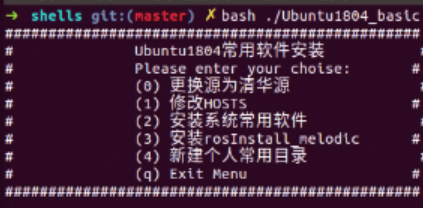

<!--
 * @Copyright: 
 * @file name: File name
 * @Data: Do not edit
 * @LastEditor: 
 * @LastData: 
 * @Describe: 
-->
## Shell仓库

Ubuntu18.04基本系统的一键配置工具

## 参考

[fengyuhetao/shell: Linux命令行与shell脚本编程大全案例 (github.com)](https://github.com/fengyuhetao/shell)
